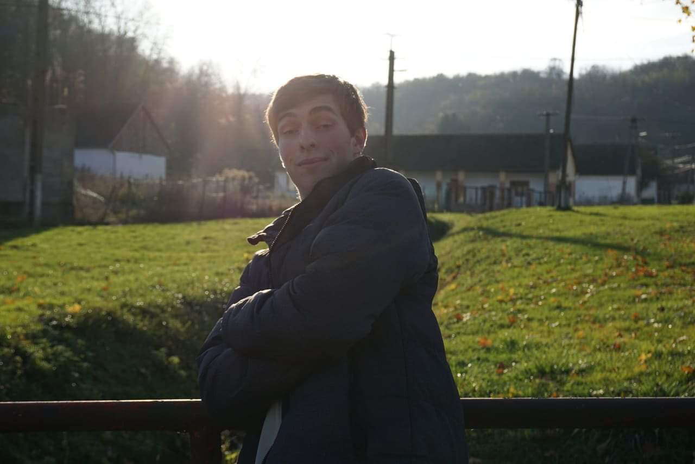

# Petr Laštovička (Lasta Apps)

## About me

Hi, I'm student of FIT CTU in Prague with love for programming, theory, math,
social activity and playing guitar. Currently, I'm doing my bachelor's in
theoretical informatics. I started programming in my 8th class of elementary
school, gained self-though knowledge during high school and extended it
significantly. I'm loving it so far.

| Key  | Value  |
|---|---|
| Name | Petr Laštovička |
| Born | 2002 |
| High school | Gymnázium Pelhřimov (Grammar school) (2016 - 2021)| 
| University | Faculty of Information Technology CTU Prague (2021 - …) |
| Field | Theoretical informatics |
| Study average | 1.05 |
| ORCID | [0009-0001-1679-6221](https://orcid.org/0009-0001-1679-6221) |
| Hobbies | Programming, Guitar playing, Dancing |

## Publications

- Flexible realizations existence: NP-completeness on sparse graphs and algorithms,
  Petr Laštovička, Jan Legerský, 2024,
  [arXiv.org](https://www.arxiv.org/abs/2412.13721)

## Languages, Technologies
| Level  | Languages, tools, platforms, … |
|---|---|
| Quite good | C, C++, Kotlin, Android SDK, Git, Python, Linux |
| I can manage | Rust, Go, Scala, SQL, Shell, Docker, Gradle, Java, Lisp, … |
| Fields | Algorithms, Data structures, Compilers, Deep learning, App development, Functional prog., Non-basic uni math |
| Android, Kotlin stack | KMP, Compose, SQLDelight, Koin, MVVM, Views, Ktor, … |
| B2 | English |
| A2 | German |
| C2 | Czech |

Check my coding style (not only) in my [Advent of Code repo](https://github.com/Lastaapps/advent-of-code/).

<!-- This is totally irrelevant as GitHub stats are broken -->
<!--  -->

## Experience, achievements

- Matee devs - Android app development, 1 year
- Teaching C at FIT CTU, 2 semesters
- Teaching C++ at FIT CTU, 1 semester
- Erasmus at TalTech, Estonia, 1 semester
- small contracts
- also note the projects listed bellow

- [Asuro](https://www.dlr.de/rm/en/desktopdefault.aspx/tabid-14006/#gallery/34068) project participant
- Physics Olympics winner (regional lever only)
- Physics selective course [Táňa](http://fyzikalniolympiada.cz/Tana)

## Projects

### High school

- Many small Android apps
- Bakaláři mobile client (huge, but never finished & published)
- Arduino/ESP weather station

### University

- [Menza CTU](https://github.com/Lastaapps/menza) - Mobile client + server for viewing and rating CTU canteen menus (2000+ users), Kotlin
- [Lispík](https://github.com/Lastaapps/Lispik) - SECD VM and compiler for basic Lisp constructs, Kotlin
- [Mila](https://github.com/Lastaapps/Lispik) - Pascal compiler, Rust
- [vimxel](https://github.com/Lastaapps/menza) - Table processor in terminal supporting expressions and Vim bindings, C++
- [Vector house](https://github.com/Lastaapps/vector-house) - Vector based search engine for Wikipedia, Python
- [C++](https://github.com/Lastaapps/ctu-pa2-progtest) course repository
- [C](https://github.com/Lastaapps/ctu-pa1-progtest) course repository
- [Algorithms](https://github.com/Lastaapps/BI-AG1-Progtest) repository ([advanced course](https://github.com/Lastaapps/ctu-ag2-progtest))
- and more minor projects

#### Self-hosting

- Raspberry Pi4
- Alma Linux
- Nginx
- Own rating backend for the Menza app
- Synapse Matrix
- Nextcloud
- Syncthing
- WordPress
- and more…

## Contact

 - [Email - lastaappsdev@gmail.com](mailto:lastaappsdev@gmail.com)
 - [GitHub - LastaApps](https://github.com/Lastaapps)
 - [Telegram - @to_urcite_ty_kokos](https://t.me/to_urcite_ty_kokos)
 - [Matrix - @to_urcite_ty_kokos:lastope2.sh.cvut.cz](@to_urcite_ty_kokos:lastope2.sh.cvut.cz) ([backup](@to_urcite_ty_kokos:matrix.org))
 - [LinkedIn](https://www.linkedin.com/in/petr-laštovička-597a11188/)
 
## And btw

I use ~~Arch~~ NixOS (and NeoVim).

